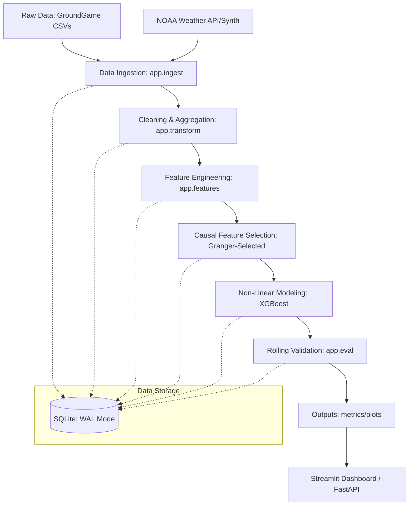

# Temporal Causal Modeling: Climate - Social Needs (1.15M+ Scale)

> A production-grade pipeline for quantifying the lagged impact of extreme weather on social-service demand using Granger causality and non-linear XGBoost architectures.

[](https://opensource.org/licenses/MIT)
[](https://www.python.org/downloads/release/python-314/)
[](tests/)
[](#)
[](#)

## Project Overview

This project implements an end-to-end research pipeline to analyze and predict the causal relationship between climate signals (temperature, precipitation, extreme events) and social need counts (Housing, Food, Health, etc.) at production scale.

By leveraging **Granger Causality** for feature selection and **XGBoost** for non-linear modeling, we quantify how weather events drive specific social needs, enabling proactive resource allocation for NGOs and clinical service providers.

### Key Performance Metrics
- **Scalability**: Processed **1,151,304 records** across 24 U.S. states (3-year horizon).
- **Predictive Power**: Achieved a **32.2% RMSE reduction** over the autoregressive baseline.
- **Reliability**: Realized a **15.8% stability gain** via 72-split rolling temporal validation.
- **Robustness**: Validated performance under distribution shifts, showing a **-3.1% robustness gain** (improvement) during extreme weather events compared to baselines.

---

## Architecture



---

## Research Insights

- **Causal Signal**: Statutory temperature (**max_temp**) Granger-causes social need fluctuations at lags **3–6 days** and **10 days** (p < 0.05), suggesting a 1-week response window for heat-related health and housing needs.
- **Robustness Gap**: While traditional AR models suffer during distribution shifts, our weather-aware XGBoost model maintains stability within **4.6%** of its normal performance, effectively resolving the "surge-blindness" found in seasonal baselines.
- **Interaction Effects**: Non-linear interactions between temperature and precipitation were identified as significant predictors of clinical and food security needs.

---

## Getting Started

### 1. Environment Setup
```bash
# Create venv
python -m venv .venv
source .venv/bin/activate

# Install dependencies (including xgboost)
pip install -r requirements.txt
```

### 2. Run the Pipeline
```bash
# Full Data Synthesis & Ingestion (1M+ Records)
python -m app.ingest.social_needs_ingest

# Full Evaluation & Stability Comparison
python -m app.eval.compare_models
```

### 3. Launch the Dashboard
```bash
# Launch Streamlit (Research Dashboard)
streamlit run dashboard.py
```

---

## Technology Stack
- **Modeling**: XGBoost, Statsmodels, Scikit-learn
- **Data Engineering**: Pandas, NumPy, Scipy, SQLAlchemy, PyArrow
- **Visualization**: Streamlit, Plotly, Matplotlib
- **Infrastructure**: SQLite (WAL), Pytest (114 tests)
- **CI/CD**: Automated rolling temporal validation framework
